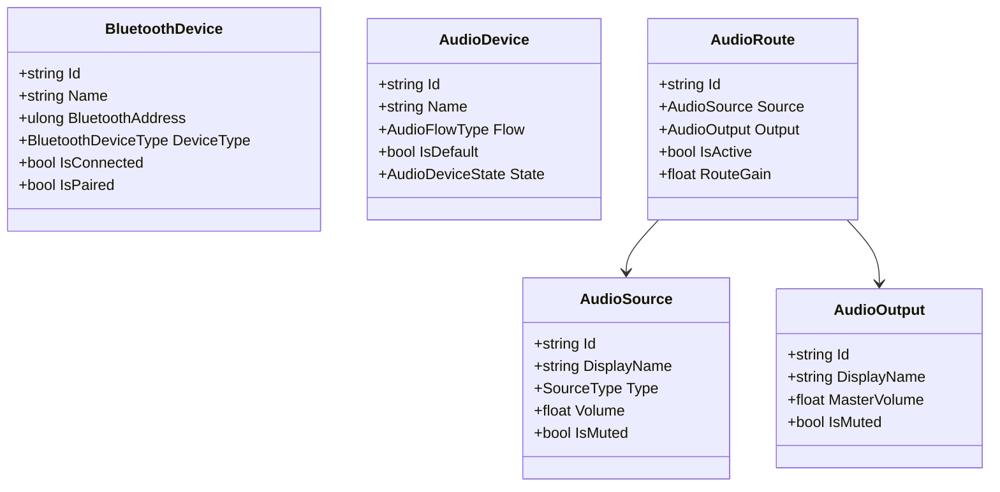

# EagleBT System Architecture

## 1. Executive Summary

**EagleBT** is a native Windows desktop application designed to act as a central Bluetooth audio router and hub. It addresses the user scenario where multiple audio sources (smartphones, tablets, local PC applications) need to be routed simultaneously or dynamically to a single set of Bluetooth headphones/earbuds (**Mustang GoBoult Torq**).

---

## 2. High-Level Architectural Diagram

```text
┌─────────────────────────────────────────────────────────────┐
│                 Presentation Layer (WinUI 3)                │
│                 Views & MVVM ViewModels                     │
└──────────────────────────────┬──────────────────────────────┘
                               │
                               ▼
┌─────────────────────────────────────────────────────────────┐
│                 Application & Core Domain                   │
│                                                             │
│  - Device Models (BluetoothDevice, AudioDevice)             │
│  - Routing Models (AudioSource, AudioOutput, AudioRoute)    │
│  - Service Abstractions (IBluetoothDeviceService, etc.)     │
└──────────────────────────────┬──────────────────────────────┘
                               │
                ┌──────────────┴──────────────┐
                ▼                             ▼
┌─────────────────────────────┐ ┌─────────────────────────────┐
│     Windows Bluetooth       │ │        Windows Audio        │
│  - WinRT Bluetooth APIs     │ │  - WASAPI Endpoints         │
│  - DeviceWatcher            │ │  - Audio Client & Capture   │
│  - A2DP / Hands-Free APIs   │ │  - Endpoint Notification    │
└─────────────────────────────┘ └─────────────────────────────┘
```

---

## 3. Clean Architecture & Layer Responsibilities

1. **`AudioHub.Core`** (Domain & Abstractions):
   - Contains pure business logic, models, and interfaces.
   - Strictly platform-agnostic and testable in isolation.
   - **Zero references** to WinUI, Windows SDK, or UI presentation libraries.

2. **`AudioHub.Windows`** (Platform Implementations):
   - Implements `AudioHub.Core` interfaces using native Windows APIs.
   - Target Framework: `net8.0-windows10.0.19041.0`.
   - Isolates `Windows.Devices.Bluetooth`, `Windows.Devices.Enumeration`, and WASAPI Core Audio COM interop.

3. **`AudioHub.Infrastructure`** (Cross-Cutting Concerns):
   - Dependency injection container configuration (`Microsoft.Extensions.DependencyInjection`).
   - Structured logging setup (`Microsoft.Extensions.Logging`).
   - JSON-based application configuration.

4. **`AudioHub.App`** (Presentation Layer):
   - WinUI 3 desktop application using the Windows App SDK.
   - Follows strict MVVM pattern: Views bind to ViewModels; ViewModels interact only with Core service interfaces.
   - Code-behind is limited strictly to UI lifecycle; no business or device logic in XAML code-behind.

5. **`tests/`**:
   - `AudioHub.Core.Tests`: Unit tests for domain routing logic, state machines, and volume calculations.
   - `AudioHub.Windows.Tests`: Integration tests and hardware mocks for Windows subsystem services.

---

## 4. Core Domain Concepts



---

## 5. Architectural Quality Attributes

- **Correctness & Robustness**: Resilient against sudden Bluetooth disconnects, audio device removals, and format changes.
- **Maintainability**: Low coupling via dependency inversion and interface segregation.
- **Low Latency**: Audio pipelines designed for minimal buffering and real-time responsiveness.
- **Simplicity**: No external microservices, cloud backends, or heavy third-party framework overhead.
